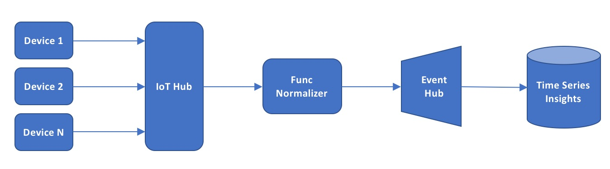

# CAT IoT hackathon 

The goal is to build an end to end pipeline for telematics collection and visualization. 

# Prerequisites 
0. git
1. az cli
2. docker

Clone this repo as follows:
```shell
git clone <this repo uri> cat-iot-hack
cd cat-iot-hack
git submodule update --init --recursive
```

Update az cli:
```shell
az component update
```

# Requirements
Build a device firmware that connects to an IoT Hub using MQTT protocol and emits simple telemetry protobuf encoded data packets every 5 seconds. Collect the telemetry and visualize it in Azure Time Series Insights. 

The target architecture of the solution must be as follows: 


### General requirements
* The telemetry packet should be encoded using Protobuf.
* For simplicity, have the telemetry packet contain a single sensor value of type `double` - a speed of wind.
* The firmware should use MQTT protocol to connect to IoT Hub.
* Use docker to deploy the firmware in a docker container. 
* Use Azure Container Instance to run your docker container.
* Use Azure Function to convert Protobuf to Json.
* Use Azure Time Series Insights to render the sensor value over time.
* Try to script every step using az cli. Prefer usage of az cli over Azure portal for every step (where possible). Pretend as if Azure Portal was unavailable.

### IoT Hub Requirements
Create an IoT Hub using S1 SKU. Don't use Free SKU. Create at least three devices in it. Use `az cli` to create the IoT Hub and devices. 

### Device requirements
Firmware must be deployed as a docker container in Azure Container Instance to simulate a single device. You should strive for the least size of the resultant container image - think in terms of the resource constrained device. The docker image should take _Device Id_, _Device SAS Key_ and _IoT Hub Name_ as environment variables. This will allow you to launch multiple instances of the same container image to simulate multiple devices. In other words, you will have a single container instance per device.

You aren't forbidden to pick any IoT Hub SDK, but to achieve the minimum size of the resultant image on X64 architecture you are strongly encouraged to use IoT Hub C SDK and Alpine Linux docker image. Not to start from scratch there's a skeleton code in [device-sim](/device-sim) directory that you can use as a starting point. Instructions and hints how to compile and build Docker image are contained in [device-sim](/device-sim).

Make sure that every 5 seconds the emitted sensor value is random but oscillates around some base value to look realisctically on the TSI graph :)

### Device simulation requirements
Afte you create the firmware container, launch it as an Azure Container Instance. To achieve this you will need to create an Azure Container Registry and push your docker image to the created ACR registry.

Simulate at least three devices using ACI.

### Azure Function requirements
At the moment of this writing, Azure TSI supports only Json as input data format and EventHub as input data source. The device emits Protobuf messages however. You must build a simple Azure function to convert from Protobuf to Json encoding. Try to build this function using C# scripting language and [Protobuf-net Nuget package](https://www.nuget.org/packages/protobuf-net/). Ensure that during conversion you don't lose such information as Device Id as you will want to split the TSI grap by Device Id. You will have to send the resultant Json output to another EventHub, so create an event hub.

Note: use Azure Function runtime version 1 as runtime 2.0 (beta version) does not yet support EventHub bindings.

### TSI requirements
[Follow this link to create a TSI environment and wire it up to the EventHub](https://docs.microsoft.com/en-us/azure/time-series-insights/time-series-insights-get-started)
