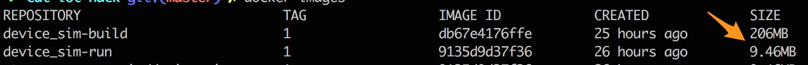

# Skeleton for the firmware based on C SDK

The skeleton code contains all the heavy lifting code so you only need to replace _TODO placeholders_ with appropriate IoT Hub C SDK functions.

You need to alter two files:
* [sim_d2c.c](./src/sim_d2c.c). This is where you need to invoke proper C SDK _LL functions to connect and send telematics data to IoT Hub.
* [messages.c](./src/messages.c). This is where you need to generate the wind speed sensor value randomly but creatively :)

### Creating the build docker image
Since you will have to build the code for Alpine Linux create, build and run the _build_ container image where you will compile the code. Name this image `device_sim-build:1`. Your image should derive from the latest Alpine Linux image and will need the following apk (Alpine package manager) packages installed:
* build-base 
* cmake 
* openssl 
* openssl-dev
* linux-headers 
* util-linux-dev

When writing the respective `Dockerfile` you would use `RUN` instruction to `apk update` and then `apk add` the above listed packages.

As you get the image built and `docker images` command outputs the name of your container, run shell (`/bin/sh` command to `docker run`) in this container interactively mapping your local `device-sim` directory to, for example, `/app` directory in container.

As soon as you interactively shell'ed into your container you can compile the firmware as shown below
```shell
cp /app
mkdir -p cmake
cd cmake
cmake -Duse_amqp=OFF -Duse_http=OFF -Ddont_use_uploadtoblob=ON -Duse_condition=ON -Duse_wsio=OFF -Duse_cppunittest=OFF ..
cmake --build . --target device_sim

# Test that your firmware works
HUB_NAME=<Your IoT Hub Name> DEVICE_ID=<Your Device ID> DEVICE_KEY="<Your Device Key>" ./device_sim
```

Your output should look similar to the below:
```
Load config:
 hubHostname: <Your IoT Hub Name>.azure-devices.net
 deviceId: <Your Device ID>
TRC: -> 23:07:36 CONNECT | VER: 4 | KEEPALIVE: 240 | FLAGS: 192 | USERNAME: <Your IoT Hub Name>.azure-devices.net/<Your Device ID>/api-version=2016-11-14&DeviceClientType=iothubclient%2f1.1.27%20(Linux%3b%20x86_64) | PWD: XXXX | CLEAN: 0
TRC: <- 23:07:36 CONNACK | SESSION_PRESENT: false | RETURN_CODE: 0x0
TRC: FW: In onDeviceConnectionStatus for <Your Device ID>. Result: 0. Reason: 6.
TRC: FW: Device connected. Start sending messages
TRC: FW: Device device002. Sending event 1
TRC: -> 23:07:36 PUBLISH | IS_DUP: false | RETAIN: 0 | QOS: DELIVER_AT_LEAST_ONCE | TOPIC_NAME: devices/<Your Device ID>/messages/events/%24.cid=cor_1&%24.mid=msg_1 | PACKET_ID: 2 | PAYLOAD_LEN: 11
TRC: <- 23:07:36 PUBACK | PACKET_ID: 2
...
```

### Creating the runtime docker image
The _build_ image is good for compiling the firmware. However a good practice would be to create a separate _runtime_ image without SDKs to minimize the size of the runtime image. Just like you did at the previous step, create another docker image. Name it as `device_sim-run:1`.

Just like before, your image should derive from the latest Alpine Linux image. To run the firmware, you will need two apk packages installed: `openssl` and `ca-certificates`.

You will need to add the binary file `device_sim` compiled at the previous step and make it the _entry point_ (`ENTRYPOINT` instruction).

Test that your container by running container locally. You will need to pass the environment variables `HUB_NAME`, `DEVICE_ID` and `DEVICE_KEY` using `-e` option of the `docker run` command.

Note the resultant images sizes and compare the difference between the _build_ and _runtime_ image sizes.
